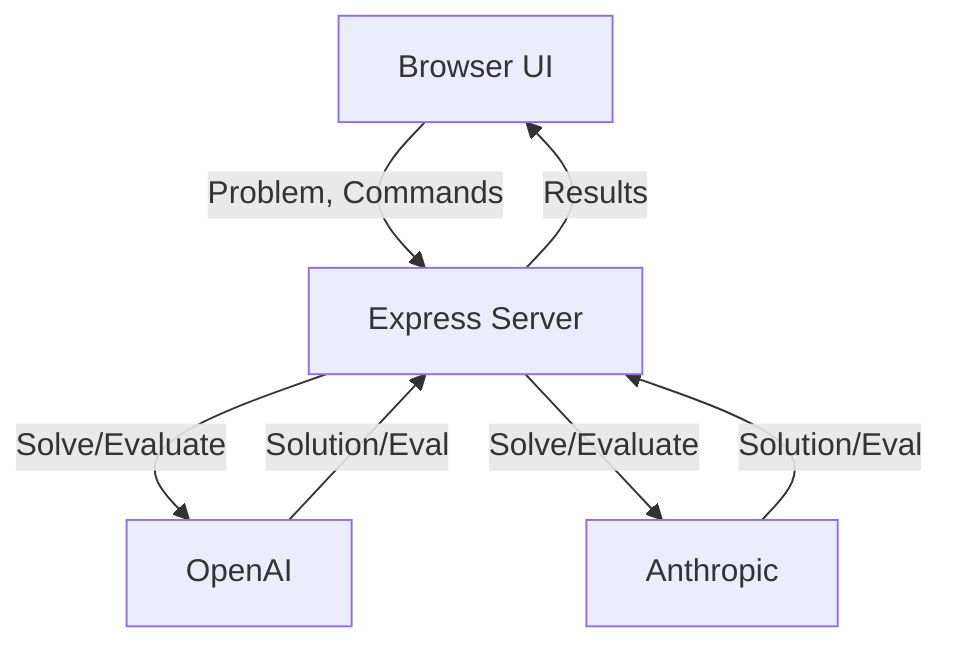

# AI LeetCode Battle Arena

AI LeetCode Battle Arena is a lightweight web application that lets multiple large language models (LLMs) compete at solving and evaluating LeetCode-style programming problems. It provides a Node.js/Express backend with a browser-based interface for submitting challenges, viewing solutions and generating peer reviews.

## Features

- **Multi-model support** – interact with OpenAI and Anthropic models through a unified API.
- **Secure server-side API keys** – API keys are never exposed to the browser.
- **Round-robin evaluations** – each model can evaluate the next model's solution.
- **Interactive front-end** – styled HTML/JS interface served from the `public` directory.

## Getting Started

### Prerequisites

- Node.js 18 or later
- An `.env` file containing `OPENAI_API_KEY` and `ANTHROPIC_API_KEY`

### Installation

1. Install dependencies (if you have a `package.json`).
   ```bash
   npm install
   ```
2. Start the server.
   ```bash
   node server.js
   ```
3. Open `http://localhost:3000` in your browser.

## API Endpoints

| Method | Endpoint       | Description            |
|--------|----------------|------------------------|
| POST   | `/api/solve`   | Generate a solution    |
| POST   | `/api/evaluate`| Evaluate a solution    |
| GET    | `/api/health`  | Health check           |

## Architecture



## Project Structure

```
.
├── public/        # Front-end assets
└── server.js      # Express application
```

## Contributing

Contributions are welcome! Feel free to open issues or submit pull requests to enhance the arena with new features or model providers.

## License

This project is licensed under the terms of the [MIT License](LICENSE).

